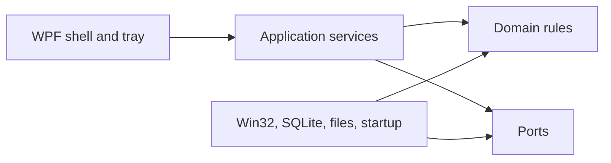
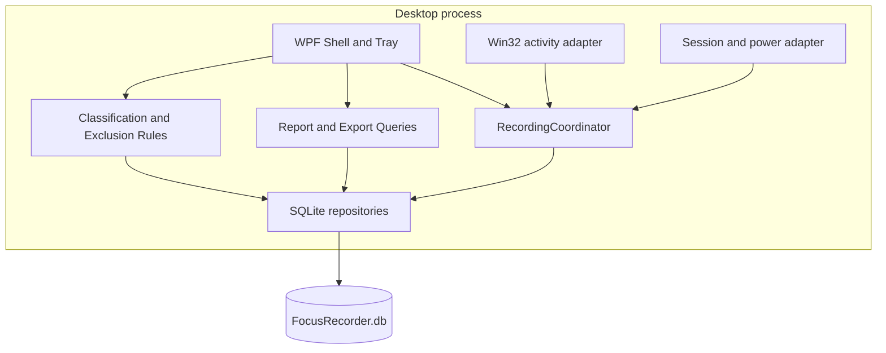
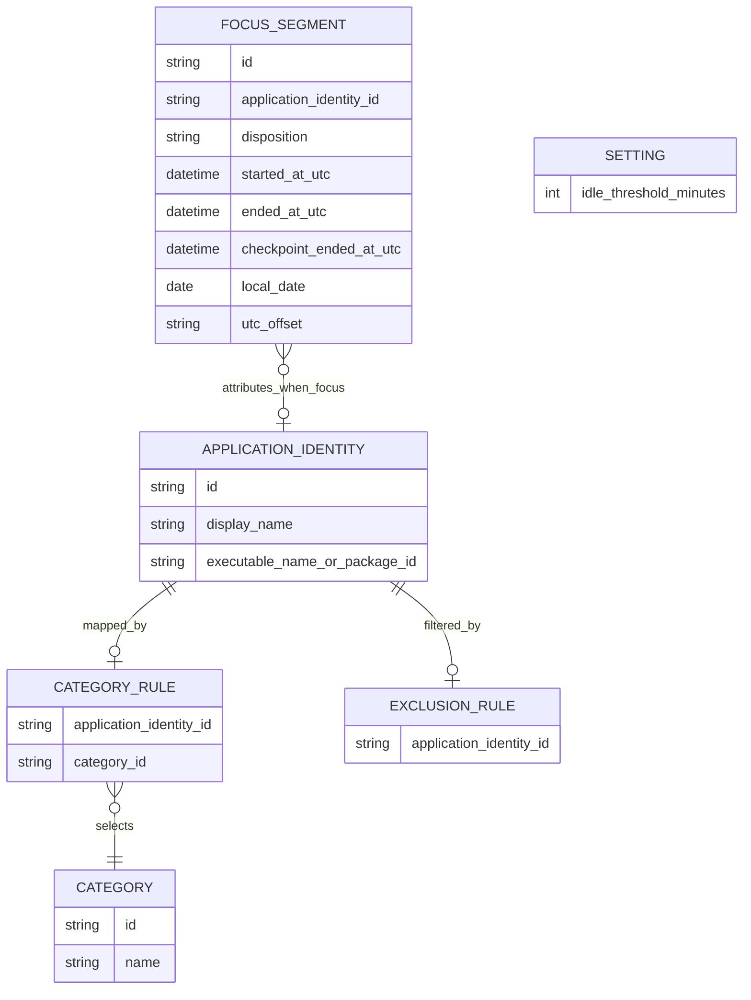

# Architecture Spine - 专注记录器

## Design Paradigm

分层单进程桌面应用：WPF 外壳承载托盘和按需显示的报表；应用层编排命令和查询；领域层定义片段、分类与统计规则；基础设施层封装 Win32、SQLite、文件导出和开机启动。后台宿主与 UI 位于同一进程，记录协调器在 UI 关闭后继续运行。



## Invariants & Rules

### AD-1 - 单进程后台宿主

- **Binds:** FR-1, FR-4, FR-7, FR-10
- **Prevents:** UI 与独立记录服务拥有不同生命周期或各自写入活动数据。
- **Rule:** 每个 Windows 用户会话只允许一个应用实例：第二实例向既有实例发送“显示或激活主窗口”请求后退出；若无法联系既有实例，则显示被动错误状态并不启动第二个记录协调器。只有应用层可启动或停止记录协调器；关闭主窗口只隐藏 UI，显式“退出”才停止宿主。

### AD-2 - 最小化 Win32 采集边界

- **Binds:** FR-2, FR-3, FR-4, FR-8
- **Prevents:** 采集层悄然扩大为窗口标题、路径、内容或输入行为监控。
- **Rule:** Win32 适配器只能向上返回稳定应用身份、显示名、采样时刻和当前会话的空闲时长。它不得返回或持久化窗口标题、文件路径、网页或文档内容、键盘数据、鼠标轨迹、截图或进程 ID。前台窗口使用 `GetForegroundWindow`；若无法取得可执行文件名或包标识，适配器发布“身份不可用”边界，协调器不创建 focus 片段。空闲检测使用会话范围的 `GetLastInputInfo`；锁屏和电源事件由 AD-10 的独立适配器提供。

### AD-3 - SQLite 是唯一持久化事实源

- **Binds:** FR-2, FR-3, FR-5, FR-6, FR-8, FR-11, FR-12
- **Prevents:** 报表缓存和原始记录各自成为真相，导致修改分类后历史统计不一致。
- **Rule:** 单个本地 SQLite 数据库保存专注片段、应用分类规则、排除规则、设置和本地结构化日志；报表、排名和导出均从片段与当前规则查询推导。不得把统计摘要作为独立可编辑事实源。

### AD-4 - 记录协调器独占状态与写入

- **Binds:** FR-1, FR-2, FR-3, FR-10, FR-11
- **Prevents:** 采样、暂停、空闲或日期切换并发写入而产生重叠、遗漏或未关闭片段。
- **Rule:** `RecordingCoordinator` 是唯一可创建、关闭或拆分片段的组件。UI 和托盘只提交命令；采集器和会话/电源适配器只产生信号。协调器按单序列处理信号，并在应用切换、空闲进入/退出、锁定、睡眠、恢复、暂停、恢复记录和本地午夜关闭并新建片段。信号必须严格晚于最后处理时刻；乱序或同刻重复信号被归一化或忽略并写入无敏感信息日志。

### AD-5 - 稳定应用身份不含瞬态或敏感字段

- **Binds:** FR-2, FR-5, FR-11
- **Prevents:** 用易复用的进程 ID 分类，或将绝对路径和窗口内容写入个人活动库。
- **Rule:** 持久化的 `ApplicationIdentity` 仅由应用显示名与可执行文件名或 Windows 包标识组成。归一化优先使用包标识；没有包标识时，使用 Unicode 规范化后的显示名与小写可执行文件名。归一化身份键必须持久化并具有唯一索引；并发写入冲突时在同一事务中读取既有身份。字段冲突时保留为不同身份，不得猜测合并。进程 ID 和可执行文件完整路径仅可在一次 Win32 查询期间使用，完成身份归一化后立即丢弃；分类和排除规则必须以 `ApplicationIdentity` 为键。

### AD-6 - 本地数据与导出边界

- **Binds:** FR-8, FR-9, FR-12
- **Prevents:** v1 意外建立网络出口或把原始片段带入导出文件。
- **Rule:** 数据库、设置和导出默认存放在当前用户的 `%LocalAppData%/FocusRecorder`。v1 不包含 HTTP 客户端、账号、遥测或同步任务。`SummaryExporter` 只能读取统计查询结果并写出 CSV 或 JSON 摘要；不得读取或导出原始片段。未来同步必须由用户显式开启，并在开启前说明只上传聚合摘要。

### AD-7 - 时间与片段规则集中执行

- **Binds:** FR-2, FR-3, FR-6
- **Prevents:** 采集、报表和导出对时区、跨日、空闲阈值或短暂切换采用不同算法。
- **Rule:** 所有片段边界以 UTC 即时点保存。协调器以 5 秒默认采样和设置中的空闲阈值执行规则：切换发生时先保留候选片段；若其从开始到下一次采样确认少于 15 秒且前后稳定应用身份相同，则删除候选边界并把时长合并回前后身份，否则在确认时关闭前片段并开始新片段。跨本地自然日及系统时区变化都必须在变化时刻拆分开放片段，并分别写入新的 `local_date` 与 UTC 偏移。每种片段状态及其统计含义由 AD-11 固定，日期归属由 AD-17 固定，查询口径由 AD-13 固定。

### AD-8 - 无打扰的启动与故障呈现

- **Binds:** FR-1, FR-4
- **Prevents:** 开机启动失败或采集异常演变为弹窗、通知轰炸或静默停摆。
- **Rule:** `StartupRegistration` 由设置命令显式启用或关闭，并且只写入或删除 `HKCU\\Software\\Microsoft\\Windows\\CurrentVersion\\Run` 的产品值。后台故障只写本地结构化日志并更新主界面/托盘中的被动状态；正常记录期间不发送系统通知、不显示模态窗口，也不请求用户解释活动。

### AD-9 - 检查点与异常恢复

- **Binds:** FR-1, FR-2, FR-3, FR-8
- **Prevents:** 只在片段结束时落盘，使崩溃或关机丢失数小时活动，或恢复后重复计算。
- **Rule:** 协调器在片段创建时落盘，每 30 秒在 SQLite 事务中更新开放片段的检查点结束时间，并在状态边界时立即关闭它。启动时，仓储将遗留开放片段关闭到最后检查点；协调器只在收到新的合格信号后开始新片段。检测到数据库损坏或迁移失败时，应用进入被动只读故障状态，不再记录；用户只能在明确确认后重新初始化本地数据库。由此将连续活动漏记上限约束为 1 分钟。

### AD-10 - 会话与电源边界来源

- **Binds:** FR-3, FR-4
- **Prevents:** 各实现以轮询或猜测处理锁屏、解锁、睡眠和恢复，造成跨状态计时。
- **Rule:** 隐藏消息窗口是唯一的会话与电源事件适配器：它为当前会话注册 `WTSRegisterSessionNotification` 并转发 `WM_WTSSESSION_CHANGE` 锁定/解锁事件，接收 `WM_POWERBROADCAST` 挂起/恢复事件。适配器只发布边界信号给协调器；注册失败只显示被动本地状态。

### AD-11 - 片段状态与身份暴露

- **Binds:** FR-3, FR-6, FR-10, FR-11, FR-12
- **Prevents:** 空闲时间被间隙推测、导出与报表口径不一致，或排除/暂停状态仍保存应用身份。
- **Rule:** 片段 `disposition` 只能是 `focus`、`idle`、`excluded`、`paused`、`locked` 或 `sleeping`。全部状态均持久化以解释时间边界；只有 `focus` 计入专注总时长。应用身份和排除历史语义由 AD-16 固定。

### AD-12 - 原子用户控制与数据删除

- **Binds:** FR-5, FR-8, FR-10, FR-11, FR-12
- **Prevents:** 删除、规则修改和导出读取到半完成状态，或单日删除破坏共享的应用身份和分类规则。
- **Rule:** 每个用户写命令在单一 SQLite 事务中完成，并通过协调器单序列串行化：删除覆盖开放片段时，先关闭并从协调器内存状态移除，再执行删除；删除完成后只有新的合格信号才能创建片段。单日删除只删除该本机自然日的片段；全部删除移除片段、规则、分类、设置和本地日志，但保留可重新初始化的数据库文件，并在接受新命令前重新初始化默认设置和“未分类”类别。全量删除不撤销当前用户的自启动注册值；首次重启时设置页必须显示其仍然启用。读取、报表和导出使用一个一致性快照。

### AD-13 - 统计、展示与导出契约

- **Binds:** FR-5, FR-6, FR-7, FR-12
- **Prevents:** 不同界面或导出对未分类、空闲、排名和时长计算出不同结果。
- **Rule:** 报表查询是统计口径的唯一实现；即使某日没有 focus 片段，也必须返回空应用/分类列表及该日 idle 总时长。仅 `focus` 片段进入应用与分类累计；未分类 `focus` 同时进入专注总时长和“未分类”。分类占比分母是所有 `focus` 片段；排名按累计专注时长降序、名称升序。展示按分钟，少于一分钟显示为“<1 分钟”。摘要导出以每日一条 `idle_duration` 汇总和零至多条 focus 应用行组成：focus 行必须含日期、分类、应用名、累计专注时长，idle 汇总行的分类和应用名为空；`idle`、`locked`、`paused`、`sleeping` 与 `excluded` 不导出为应用行。

### AD-14 - 本地设置与分类生命周期

- **Binds:** FR-3, FR-5
- **Prevents:** 空闲阈值和自定义分类由 UI 各自解释，或删除已引用类别造成悬挂规则。
- **Rule:** `Settings` 在本地保存空闲阈值，允许范围为 1 至 60 分钟。阈值变更在下一采样信号按当前 `GetLastInputInfo` 重新判定；若已超过新阈值，协调器立即在该信号时刻关闭 focus 并进入 idle，不回写历史边界。首次运行初始化编程、AI 对话、资料阅读、写作、沟通、娱乐/休闲、其他和未分类；用户可以新增或改名类别。删除类别时，事务内把依赖规则改指向“未分类”。

### AD-15 - 受支持平台与性能预算

- **Binds:** FR-1, FR-2, FR-3, FR-8
- **Prevents:** 对不受 .NET 10 支持的 Windows SKU 承诺运行，或把资源目标留给各模块自行猜测。
- **Rule:** v1 支持 Windows 11 22H2（build 22621）及以上，以及 Windows 10 Enterprise LTSC 2021（21H2，build 19044）及以上；运行时固定为 .NET 10 LTS；不支持管理员级自启动。5 秒采样、30 秒检查点和查询必须使正常记录平均 CPU 小于 1%、进程内存小于 150 MB；在连续 8 小时合成采样、每 5 秒一次、每 30 秒 checkpoint 的集成测试和手动性能验收中测量。

### AD-16 - 身份可选性与排除历史语义

- **Binds:** FR-6, FR-8, FR-11, FR-12
- **Prevents:** ER 模型强制非专注片段携带应用身份，或移除排除规则后各实现对历史时段采取不同处理。
- **Rule:** `ApplicationIdentityId` 对 `focus` 片段必填，对 `idle` 和所有非专注状态均为空。排除规则只在协调器处理未来信号时生效：规则激活期间写入不带身份的 `excluded` 片段；移除规则只影响后续信号，不恢复既往排除时段。

### AD-17 - 固化本地日期归属

- **Binds:** FR-3, FR-6, FR-12
- **Prevents:** 用户旅行或修改系统时区后，报表、导出和单日删除对历史片段分配到不同日期。
- **Rule:** 创建或拆分片段时，按当时本机时区写入 `local_date` 与 UTC 偏移量。展示、按日统计、导出和单日删除均按存储的 `local_date` 分组；之后修改系统时区不改变历史归属。

### AD-18 - 报表查询模型

- **Binds:** FR-6, FR-7
- **Prevents:** UI 自行重新计算统计，或只实现聚合表而遗漏日期选择与未分类应用复盘。
- **Rule:** 报表查询必须接收本地日期，并为该日期返回应用行、分类行和未分类应用列表。WPF 界面只能渲染这些查询模型，不得重算累计、比例或排名。

### AD-19 - 同库日志与未来同步授权

- **Binds:** FR-4, FR-8, FR-9
- **Prevents:** 全量删除无法跨文件原子完成，或 v2 同步绕开用户授权和摘要边界。
- **Rule:** 所有本地结构化日志均以 SQLite 行保存，因而全量删除可在同一事务完成。未来同步必须为显式选择加入，开启前说明只上传聚合摘要；原始片段和被禁采集字段永远不得成为同步载荷。

## Consistency Conventions

| Concern | Convention |
| --- | --- |
| Naming | C# 类型使用 PascalCase；命令以动词结尾 `Command`，查询以名词结尾 `Query`；端口接口以 `I` 开头。 |
| Data & formats | SQLite 主键使用 UUID 文本；持久化时间为 UTC ISO 8601；时长以整数毫秒存储；枚举以稳定字符串保存。 |
| State mutation | 只有应用命令处理器调用 `RecordingCoordinator` 或规则仓储的写方法；报表、导出与 UI 只通过查询读取。 |
| Database evolution | 数据库 schema 版本迁移在应用启动时串行执行并包在事务中；迁移不得删除用户数据。 |
| Errors & logging | 基础设施异常转换为不含采集内容的领域错误码；日志不记录应用路径、窗口标题或其他被禁字段。 |
| Testing | 领域与应用测试使用合成的采样、会话和电源信号；测试夹具不得调用真实 Win32 API 或包含用户活动数据。 |

## Stack

| Name | Version |
| --- | --- |
| .NET SDK / runtime | 10.0 LTS |
| WPF | .NET 10 |
| Microsoft.Data.Sqlite | 10.0.11 |
| Windows | Windows 11 22H2+；受当前 .NET 10 矩阵支持的 Windows 10 LTSC/Enterprise |

## Structural Seed





```text
src/
  FocusRecorder.App/              # WPF shell, tray, composition root
  FocusRecorder.Application/      # commands, queries, coordinator, ports
  FocusRecorder.Domain/           # entities, segment and report rules
  FocusRecorder.Infrastructure/   # Win32, SQLite, file export, startup adapter
tests/
  FocusRecorder.Domain.Tests/     # deterministic segment and report rules
  FocusRecorder.Application.Tests/# coordinator command and signal flows
  FocusRecorder.Infrastructure.Tests/ # SQLite migrations and adapter contracts
```

## Capability -> Architecture Map

| Capability / Area | Lives in | Governed by |
| --- | --- | --- |
| 后台运行、托盘与开机启动 | App shell, background host, startup adapter | AD-1, AD-8, AD-15 |
| 活跃应用采样与空闲识别 | Win32 adapter, session/power adapter, RecordingCoordinator | AD-2, AD-4, AD-5, AD-7, AD-9, AD-10, AD-11 |
| 分类、排除与暂停 | application commands, rule repositories, coordinator | AD-3, AD-4, AD-5, AD-11, AD-12, AD-14 |
| 每日统计与历史报表 | report queries, domain aggregation | AD-3, AD-7, AD-11, AD-13, AD-18 |
| 删除与摘要导出 | repositories, SummaryExporter | AD-3, AD-6, AD-12, AD-13 |
| 本地优先与未来同步边界 | LocalApplicationData storage, composition root | AD-6 |

## Deferred

- 视频、会议等无输入但仍在专注的例外规则：首周真实误判证据出现后再决定。
- 时间线视图与复杂图表：列表和基础占比不能解释一天上下文时再设计。
- 浏览器内 AI 对话分类：v1 只按应用手动映射，分类不稳定时再评估。
- 后端摘要同步、账号与网络协议：v2 开始同步设计前决定；必须保留 AD-6 与 AD-19 的摘要和显式授权边界。
- 安装包、代码签名和自动更新通道：进入可分发版本时决定；不影响个人 v1 的运行时边界。
- 自动备份与跨设备恢复：v1 不提供；数据库损坏时按 AD-9 进入只读故障状态并由用户明确确认后重新初始化。
- 日志保留：结构化日志最多保留 90 天或 10,000 条，超出时按最早记录优先删除；不得影响专注片段或用户规则。
